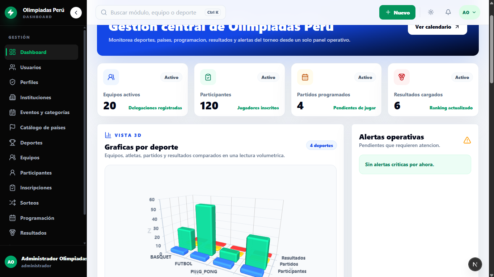
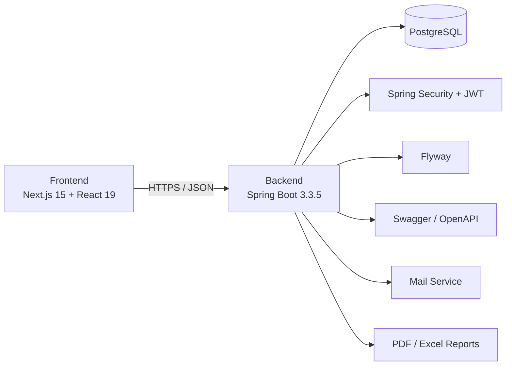
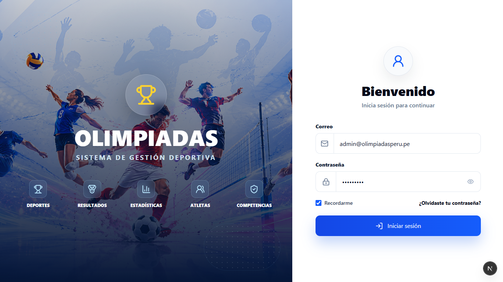
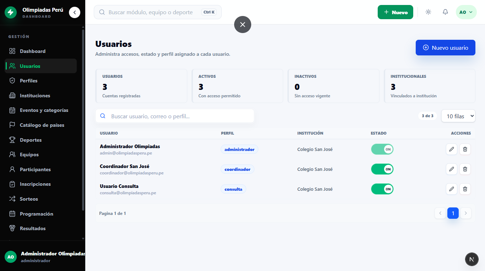
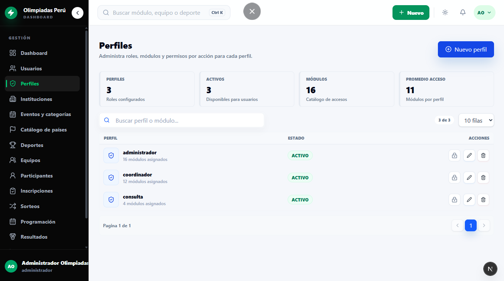
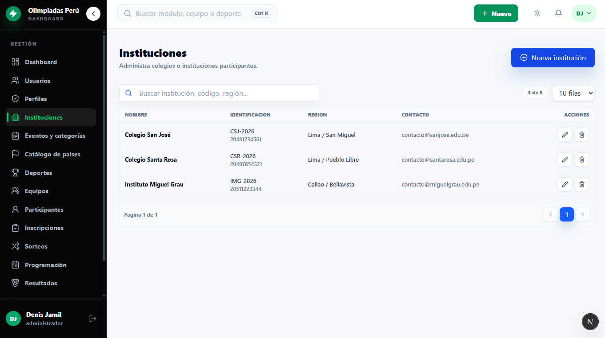
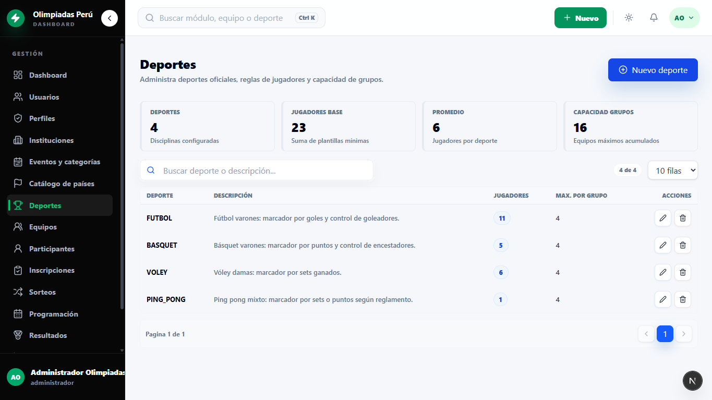

<div align="center">

# 🏅 Olimpiadas Perú 🇵🇪

### *Sports Event Management Platform for Schools & Institutions*

<p align="center">
  
  
  
  
</p>

<p align="center">
  
  
  
  
  
  
  
  
</p>



<br/>

</div>

---


Sistema web para la gestión de olimpiadas internas de instituciones educativas. La solución permite administrar el flujo completo del evento: institución, categorías con país representativo, equipos, participantes, inscripciones, sorteos, programación de partidos, resultados, estadísticas, reportes, usuarios, roles y permisos por módulo.

El proyecto está orientado a una arquitectura de servicios con backend REST en Spring Boot y frontend en Next.js.

## Arquitectura

```text
OLIMPIADASPERU/
├── backend/     API REST con Spring Boot
├── frontend/    Portal público y panel administrativo con Next.js
└── docs/        Guías internas del equipo
```
### Diagrama visual de arquitectura



---
## Tecnologías

| Capa | Tecnología |
| --- | --- |
| Backend | Java 21, Spring Boot 3.3.5, Spring Security, JWT, Spring Data JPA |
| Base de datos | PostgreSQL, H2 para pruebas |
| Migraciones/Data | Flyway, semilla demo SQL |
| Documentación API | Springdoc OpenAPI / Swagger UI |
| Frontend | Next.js 15, React 19, TypeScript, Tailwind CSS |
| UI | SweetAlert2, Lucide React |
| Reportes | PDF/Excel desde backend |
| Control de versiones | Git / GitHub |

## Módulos Implementados

<table align="center">
  <tr>
    <td align="center">
      <br/>
      <b>🏠 Hero</b>
    </td>
    <td align="center">
      <br/>
      <b>🔐 Login</b>
    </td>
  </tr>
  <tr>
    <td align="center">
      <br/>
      <b>🔐 Recuperar contraseña</b>
    </td>
    <td align="center">
      <br/>
      <b>📊 Dashboard</b>
    </td>
  </tr>
  <tr>
    <td align="center">
      <br/>
      <b>👥 Usuarios</b>
    </td>
    <td align="center">
      <br/>
      <b>👤 Perfiles</b>
    </td>
  </tr>
  <tr>
    <td align="center">
      <br/>
      <b>🏢 Instituciones</b>
    </td>
    <td align="center">
      <br/>
      <b>⚽ Deportes</b>
    </td>
  </tr>
</table>


- Portal público con hero deportivo, próximos encuentros y estadísticas.
- Autenticación con JWT, refresh token y cookies seguras.
- Recuperación de contraseña por código.
- Usuarios, roles, módulos, acciones y permisos por rol.
- Instituciones participantes.
- Catálogo de países con bandera, colores y dato cultural.
- Eventos institucionales.
- Categorías del evento con asignación automática de país.
- Deportes obligatorios: fútbol varones, básquet varones, vóley damas y ping pong mixto.
- Equipos por categoría, país y deporte.
- Participantes por equipo.
- Inscripciones por deporte.
- Sorteos y generación visual de grupos.
- Programación de partidos con fecha, hora, sede y estado.
- Registro de resultados y anotaciones individuales.
- Estadísticas deportivas.
- Reportes ejecutivos.
- Auditoría de operaciones relevantes, incluyendo cambios de permisos por rol.
- Notificaciones por correo para eventos importantes.

## Flujo De Negocio Cubierto

El flujo principal implementado sigue el enunciado del negocio:

1. Se registra una institución.
2. Se crea un evento de olimpiadas internas.
3. Se registran categorías o grupos del evento.
4. El sistema asigna países representativos sin repetir país dentro del mismo evento.
5. Cada categoría registra equipos para los deportes obligatorios.
6. Se registran participantes por equipo.
7. Los equipos se inscriben por deporte.
8. Se realiza el sorteo para formar grupos por deporte.
9. Se programan partidos entre equipos del grupo/deporte.
10. Se registran resultados y estadísticas individuales.
11. Se generan reportes y rankings.

## Data Demo

El backend incluye una semilla reiniciable en:

```text
backend/src/main/resources/demo-data.sql
```

Con `DEMO_DATA_ENABLED=true`, al iniciar el backend se limpia y recarga la data demo. La semilla actual contiene:

- 3 instituciones.
- 1 evento principal.
- 5 categorías con país asignado.
- 8 países.
- 4 deportes obligatorios.
- 20 equipos.
- 120 participantes.
- 20 inscripciones confirmadas.
- 8 grupos.
- 10 partidos.
- 6 resultados.
- 21 anotaciones individuales.

Para conservar datos creados manualmente, usar:

```env
DEMO_DATA_ENABLED=false
```

## Seguridad

- Las contraseñas se almacenan con BCrypt.
- La autenticación usa JWT.
- Los endpoints protegidos requieren sesión válida.
- Los permisos se validan por rol, módulo y acción en backend.
- El frontend oculta o restringe vistas según módulos autorizados.
- Las credenciales sensibles se cargan desde variables de entorno.
- El archivo `.env` local no se versiona.
- Se incluye `backend/.env.example` como plantilla segura.

### Modelo RBAC Granular

El sistema usa RBAC extendido con permisos funcionales. La autorización se organiza así:

```text
usuarios -> roles -> módulos -> acciones
```

Tablas principales:

| Tabla | Propósito |
| --- | --- |
| `usuarios` | Actores que ingresan al sistema. |
| `roles` | Perfiles de acceso como administrador, coordinador o consulta. |
| `modulos` | Áreas o pantallas del sistema. Soporta jerarquía mediante `modulo_padre_id`. |
| `acciones` | Catálogo administrable de operaciones: `VER`, `CREAR`, `EDITAR`, `ELIMINAR`, `EXPORTAR` y acciones personalizadas. |
| `rol_modulos` | Define qué módulos están asignados a cada rol. |
| `rol_modulo_acciones` | Define qué acciones puede ejecutar un rol sobre cada módulo. |

El módulo administrativo **Acciones** permite crear, editar y eliminar operaciones funcionales, siempre que no estén en uso por perfiles. Cada cambio de permisos queda registrado en auditoría con el resumen anterior y posterior.

Ejemplo:

```text
Rol: coordinador
Módulo: Resultados
Acciones: VER, CREAR, EDITAR, EXPORTAR
```

El backend valida estos permisos en cada request. El frontend consume los permisos devueltos en la sesión para ocultar botones de crear, editar, eliminar o exportar cuando el rol no tiene autorización.

## Variables De Entorno Backend

Crear `backend/.env` tomando como base:

```text
backend/.env.example
```

Variables principales:

```env
DB_URL=jdbc:postgresql://localhost:5432/olimpiadas_peru
DB_USERNAME=postgres
DB_PASSWORD=change_me
DB_DRIVER=org.postgresql.Driver

JPA_DDL_AUTO=update
JPA_SHOW_SQL=false
JPA_DIALECT=org.hibernate.dialect.PostgreSQLDialect
FLYWAY_ENABLED=true
DEMO_DATA_ENABLED=true

SERVER_PORT=8080
SERVER_CONTEXT_PATH=/olimpiadas

JWT_SECRET=change-this-secret-for-a-long-secure-random-value
JWT_EXPIRATION=900000
JWT_REFRESH_EXPIRATION=604800000

APP_CORS_ALLOWED_ORIGINS=http://localhost:3000,http://localhost:8080

MAIL_HOST=smtp.gmail.com
MAIL_PORT=587
MAIL_USERNAME=change_me@example.com
MAIL_PASSWORD=change_me
MAIL_SMTP_AUTH=true
MAIL_SMTP_STARTTLS_ENABLE=true

APP_FRONTEND_RESET_PASSWORD_URL=http://localhost:3000/reset-password
PASSWORD_RESET_EXPIRATION_MINUTES=30
```

## Ejecución Backend

Requisitos:

- JDK 21.
- PostgreSQL 14 o superior.
- Maven o Maven Wrapper.

Desde la carpeta `backend`:

```bash
mvn spring-boot:run
```

En Windows PowerShell:

```powershell
.\mvnw.cmd spring-boot:run
```

Base URL:

```text
http://localhost:8080/olimpiadas
```

Swagger UI:

```text
http://localhost:8080/olimpiadas/swagger-ui/index.html
```

Pruebas:

```powershell
.\mvnw.cmd test
```

## Ejecución Frontend

Requisitos:

- Node.js 20 o superior.
- Backend ejecutándose en `http://localhost:8080/olimpiadas`.

Desde la carpeta `frontend`:

```bash
npm install
npm run dev
```

URL local:

```text
http://localhost:3000
```

Variable opcional:

```env
NEXT_PUBLIC_API_BASE_URL=http://localhost:8080/olimpiadas
```

Compilar:

```bash
npm run build
```

## Credenciales De Prueba

```text
Administrador
Correo: admin@olimpiadasperu.pe
Clave: Admin123*

Coordinador
Correo: coordinador@olimpiadasperu.pe
Clave: Admin123*

Consulta
Correo: consulta@olimpiadasperu.pe
Clave: Admin123*
```

## Endpoints Principales

```text
POST /api/auth/login
POST /api/auth/refresh-token
POST /api/auth/forgot-password
POST /api/auth/reset-password

GET  /api/dashboard/resumen
GET  /api/public/dashboard

GET  /api/instituciones
GET  /api/paises
GET  /api/eventos
GET  /api/categorias-evento
GET  /api/deportes
GET  /api/equipos
GET  /api/participantes
GET  /api/inscripciones
GET  /api/sorteos
GET  /api/programaciones
GET  /api/resultados
GET  /api/estadisticas
GET  /api/reportes

GET  /api/usuarios
GET  /api/roles
GET  /api/modulos
GET  /api/auditoria
```

## Reportes

El sistema genera reportes para sustentar el avance funcional:

- Ranking por país.
- Medallero.
- Participantes por institución.
- Fixture completo.
- Reporte ejecutivo en PDF/Excel.
- Estadísticas por deporte.

## Pruebas

El backend cuenta con pruebas automatizadas para:

- Autenticación y sesión.
- Reglas por deporte.
- Participantes.
- Inscripciones.
- Sorteos.
- Programación.
- Resultados.
- Dashboard y reportes.

Comando:

```bash
mvn test
```

## Estado Del Proyecto

El sistema cubre los bloques clave solicitados para el avance:

- Ambiente backend y frontend levantado.
- Repositorio versionado con Git.
- Login seguro con JWT.
- Contraseñas encriptadas.
- Conexión a PostgreSQL mediante variables de entorno.
- CRUD principales conectados a base de datos.
- Permisos por rol y módulo.
- Flujo de inscripción con países representativos.
- Sorteos, programación, resultados y estadísticas.
- Reportes ejecutivos.
- Pruebas automatizadas.

## Autores

- Denis Jamil Tineo Huancas
